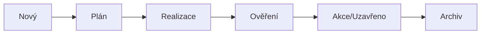

# ACTIO - Project Guide

## Přehled projektu

**ACTIO** je webová aplikace pro správu akčních plánů z auditů. Nahrazuje Excel šablonu a poskytuje centralizovaný systém pro sledování nálezů, nápravných opatření a jejich plnění.

### Typy auditů
- Interní audity
- Externí audity (certifikace ISO, IATF, apod.)
- Zákaznické audity
- Procesní audity
- Neohlášené kontroly
- Vlastní typ (volný text)

---

## Tech Stack

| Vrstva | Technologie |
|--------|-------------|
| Backend | PHP 8.x |
| Frontend | HTML5, CSS (Dashio template), JavaScript |
| Data | JSON soubory |
| Design | **Pouze dashio-template** (Bootstrap 5) |
| Architektura | Front Controller pattern |
| Překlady | DeepL API (plánováno) |
| Bezpečnost | Dle [SECURITY_REQUIREMENTS.md](./SECURITY_REQUIREMENTS.md) |

> [!IMPORTANT]
> Veškerý design musí být výhradně z `dashio-template`. Není dovoleno vytvářet vlastní CSS!

> [!NOTE]
> **Workflow pro UI:** Před vytvořením jakéhokoli HTML se vždy zeptat na referenci z dashio-template (stránka + název sekce).

> [!CAUTION]
> Všechny bezpečnostní požadavky z `SECURITY_REQUIREMENTS.md` musí být dodrženy!

---

## Struktura projektu

```
actio/
├── src/                        # Zdrojové PHP soubory
│   ├── Controllers/            # Kontrolery
│   │   ├── DashboardController.php
│   │   ├── ActionController.php
│   │   ├── AuditSessionController.php
│   │   ├── AttachmentController.php
│   │   └── AuthController.php
│   │
│   ├── Services/               # Business logika
│   │   ├── ActionService.php
│   │   ├── AuditSessionService.php
│   │   ├── ArchiveService.php      # Logika archivace (vč. auto-archivace)
│   │   ├── AuthService.php     # SELIO autentifikace
│   │   ├── NotificationService.php  # Teams webhook
│   │   ├── ExportService.php
│   │   ├── TranslationService.php   # DeepL API
│   │   └── AuditLogService.php # Historie změn
│   │
│   ├── Models/                 # Datové modely
│   │   ├── Action.php
│   │   ├── AuditSession.php
│   │   └── User.php
│   │
│   ├── Core/                   # Jádro aplikace
│   │   ├── Router.php
│   │   ├── Request.php
│   │   ├── Response.php
│   │   ├── Storage.php         # JSON file handling
│   │   └── Auth.php            # Session & authorization
│   │
│   └── Helpers/                # Pomocné funkce
│       ├── DateHelper.php
│       └── ValidationHelper.php
│
├── views/                      # PHP šablony
│   ├── layout/
│   │   ├── header.php
│   │   ├── sidebar.php
│   │   └── footer.php
│   │
│   ├── dashboard.php
│   ├── actions/
│   │   ├── list.php
│   │   ├── detail.php
│   │   └── form.php
│   │
│   ├── audit-sessions/
│   │   ├── list.php
│   │   └── detail.php
│   │
│   ├── archive/
│   │   └── list.php
│   │
│   └── auth/
│       └── login.php
│
├── data/                       # JSON úložiště
│   ├── actions.json
│   ├── audit_sessions.json
│   ├── settings.json           # Vč. last_archive_year
│   ├── audit_log.json
│   └── attachments/            # Nahraná příloh
│       └── {action_id}/
│
├── public/                     # Veřejný adresář (document root)
│   ├── index.php               # Front Controller
│   └── assets/                 # Kompilované CSS/JS z dashio
│       ├── css/
│       │   └── dashio.css
│       ├── js/
│       │   └── dashio.js
│       └── fonts/
│
├── dashio-template/            # Zdrojová šablona (reference)
│
├── config/
│   └── routes.php              # Definice rout
│
├── .env                        # Lokální konfigurace
├── .env.example
├── .gitignore                  # Ignorované soubory (E02)
├── PROJECT_GUIDE.md
├── SECURITY_REQUIREMENTS.md    # Bezpečnostní požadavky
└── README.md
```

---

## Datový model

### Action (Akce/Nález)

| Pole | Typ | Popis | Povinné |
|------|-----|-------|---------|
| `id` | int | Unikátní ID | Auto |
| `number` | int | Pořadové číslo (1, 2, 3...) | Auto |
| `audit_session_id` | int\|null | Vazba na auditní sezení | Ne |
| `rating` | string | Hodnocení nálezu | Ano |
| `finding` | string | Zjištění (CZ) | Ano |
| `finding_en` | string | Zjištění (EN) - DeepL | Auto |
| `description` | string | Popis (CZ) | Ne |
| `description_en` | string | Popis (EN) - DeepL | Auto |
| `chapter` | string | Kapitola normy | Ne |
| `problem_cause` | string | Problém / Příčina | Ano |
| `measure` | string | Opatření | Ano |
| `process` | string | Proces | Ne |
| `process_owner` | string | Majitel procesu | Ne |
| `finding_date` | date | Datum zjištění | Ano |
| `responsible` | string | Odpovědný | Ano |
| `deadline` | date | Termín | Ano |
| `status_plan` | bool | PDCA - Plán | - |
| `status_do` | bool | PDCA - Realizace | - |
| `status_check` | bool | PDCA - Ověření | - |
| `status_act` | bool | PDCA - Akce | - |
| `completed_at` | datetime\|null | Splněno dne | Auto |
| `on_time` | bool\|null | V termínu | Auto |
| `timeliness` | string | Včasnost (popis) | Auto |
| `archived` | bool | Archivováno | - |
| `created_at` | datetime | Vytvořeno | Auto |
| `created_by` | string | Vytvořil | Auto |
| `updated_at` | datetime | Aktualizováno | Auto |
| `updated_by` | string | Aktualizoval | Auto |

### AuditSession (Auditní sezení - seskupení zjištění)

Každé auditní sezení představuje konkrétní provedený audit, ze kterého vzešla zjištění/opatření.

| Pole | Typ | Popis |
|------|-----|-------|
| `id` | int | Unikátní ID |
| `name` | string | Název auditu (např. "Certifikace ISO 9001 - leden 2026") |
| `type` | string | Typ auditu (interní, certifikace, zákaznický...) |
| `date` | date | Datum auditu |
| `auditor` | string | Auditor/Auditoři |
| `standard` | string | Norma (ISO 9001, IATF 16949, apod.) |
| `notes` | text | Poznámky |
| `created_at` | datetime | Vytvořeno |

**Propojení:** Každé zjištění/opatření (Action) může být přiřazeno k jednomu AuditSession pomocí `audit_session_id`. To umožňuje:
- Filtrovat všechna zjištění z konkrétního auditu
- Souhrnné reporty za celý audit
- Sledování plnění opatření z jednoho auditu

### Attachment (Příloha)

| Pole | Typ | Popis |
|------|-----|-------|
| `id` | int | Unikátní ID |
| `action_id` | int | Vazba na akci |
| `filename` | string | Původní název souboru |
| `stored_name` | string | Uložený název |
| `mime_type` | string | MIME typ |
| `size` | int | Velikost v bytech |
| `description` | string | Popis přílohy |
| `uploaded_at` | datetime | Nahráno |
| `uploaded_by` | string | Nahrál |

---

## PDCA Workflow

Každá akce prochází PDCA cyklem:



| Status | Checkbox | Popis |
|--------|----------|-------|
| **Plan** | `status_plan` | Opatření je naplánováno, termín stanoven |
| **Do** | `status_do` | Opatření je realizováno |
| **Check** | `status_check` | Realizace je ověřena |
| **Act** | `status_act` | Akce je uzavřena, případně standardizována |

Po zaškrtnutí všech čtyř statusů:
- Automaticky se nastaví `completed_at` na aktuální datum
- Vypočítá se `on_time` (porovnání s `deadline`)
- Nastaví se `timeliness` ("V termínu" / "Po termínu o X dní")

---

## Autentifikace

### Produkce - SELIO
Autentifikace proti firemní databázi SELIO pomocí API.

```
POST /api/selio/auth
{
    "email": "user@company.com",
    "password": "..."
}
```

### Vývoj - Offline účet
Pro lokální vývoj se použije účet z `.env`:

```env
# Development auth
DEV_MODE=true
DEV_USER_EMAIL=dev@actio.local
DEV_USER_NAME=Developer
DEV_USER_ROLE=admin

# SELIO API (production)
SELIO_API_URL=https://selio.company.com/api
SELIO_API_KEY=xxx

# Teams webhook
TEAMS_WEBHOOK_URL=https://outlook.office.com/webhook/xxx

# DeepL API
DEEPL_API_KEY=xxx
```

### Role uživatelů

| Role | Oprávnění |
|------|-----------|
| `admin` | Plný přístup, správa uživatelů, nastavení |
| `auditor` | Vytváření auditů a akcí, editace všech akcí |
| `editor` | Editace přiřazených akcí |
| `viewer` | Pouze prohlížení |

Role se nastavují v `settings.json` podle emailu:

```json
{
  "roles": {
    "admin@company.com": "admin",
    "auditor@company.com": "auditor",
    "worker@company.com": "editor"
  },
  "default_role": "viewer"
}
```

---

## Notifikace - Teams Webhook

Notifikace se odesílají na Microsoft Teams při:

| Událost | Příjemce |
|---------|----------|
| Nová akce přiřazena | Odpovědný |
| Termín za 7 dní | Odpovědný |
| Termín za 3 dny | Odpovědný |
| Termín dnes | Odpovědný + Majitel procesu |
| Termín překročen | Odpovědný + Majitel procesu + Admin |
| Akce dokončena | Auditor (kdo vytvořil) |

---

## Historie změn (Audit Log)

Každá změna záznamu se loguje:

```json
{
  "id": 1,
  "entity_type": "action",
  "entity_id": 42,
  "action": "update",
  "changes": {
    "status_plan": {"from": false, "to": true},
    "responsible": {"from": "Jan Novák", "to": "Petr Svoboda"}
  },
  "user": "admin@company.com",
  "timestamp": "2026-01-12T23:00:00+01:00"
}
```

---

## Dashboard

Po přihlášení se zobrazí dashboard s:

### Statistiky (karty)
- Celkem otevřených akcí
- Po termínu (červená)
- Termín tento týden (žlutá)
- Dokončeno tento měsíc

### Seznamy
- **Moje akce** - akce kde jsem odpovědný
- **Po termínu** - všechny prošlé akce
- **Blížící se termíny** - příštích 7 dní

### Grafy
- PDCA status (koláčový)
- Akce podle procesu (sloupcový)
- Timeline plnění (spojnicový)

---

## Filtry

Filtry dostupné na seznamu akcí:

| Filtr | Typ | Hodnoty |
|-------|-----|---------|
| Číslo | text | Fulltextové hledání |
| Kapitola | select/text | Dle normy |
| Proces | select | Seznam procesů |
| Majitel procesu | select | Seznam osob |
| Datum zjištění | date range | Od - Do |
| Odpovědný | select | Seznam osob |
| Termín | date range | Od - Do |
| PDCA Status | multiselect | Plán, Realizace, Ověření, Akce |
| Typ auditu | select | Dle seznamu typů |
| Audit | select | Konkrétní audit |
| Stav | select | Otevřené, Uzavřené, Po termínu |
| Archivováno | toggle | Ano/Ne |

---

## Export

### CSV Export
Základní export všech sloupců do CSV (UTF-8 BOM pro Excel).

### Excel Export
Nativní XLSX pomocí PhpSpreadsheet nebo lightweight alternativy.

### HTML Šablona
Generování tisknutelného HTML reportu s logem firmy.

---

## Archivace

### Manuální archivace
- Tlačítko "Archivovat" na dokončených akcích
- Hromadná archivace z filtru

### Automatická archivace (Nový rok)

Při přihlášení admina po novém roce se zobrazí nabídka k archivaci:

```
┌─────────────────────────────────────────────────────────┐
│  🗂️ Archivace předchozího roku                          │
├─────────────────────────────────────────────────────────┤
│  Je nový rok! Chcete archivovat dokončená zjištění      │
│  z roku 2025?                                           │
│                                                         │
│  Nalezeno: 47 dokončených zjištění                      │
│                                                         │
│  [Archivovat vše]  [Vybrat ručně]  [Přeskočit letos]   │
└─────────────────────────────────────────────────────────┘
```

**Logika:**
1. Při každém page load se kontroluje:
   - Je uživatel admin?
   - Je aktuální rok > rok poslední archivace v `settings.json`?
   - Existují dokončená zjištění z předchozího roku?
2. Pokud ano, zobrazí se modal s nabídkou
3. Možnosti:
   - **Archivovat vše** - hromadná archivace všech dokončených
   - **Vybrat ručně** - přesměruje na filtrovaný seznam
   - **Přeskočit letos** - nastaví `last_archive_year` na aktuální rok

### Archiv
- Samostatná sekce v menu
- Záznamy jsou read-only
- Možnost "Obnovit z archivu" (admin)

---

## Dvojjazyčnost (DeepL)

Pole s automatickým překladem:
- `finding` → `finding_en`
- `description` → `description_en`
- `measure` → `measure_en`
- `problem_cause` → `problem_cause_en`

Překlad probíhá:
- Automaticky při uložení (async)
- Ručně tlačítkem "Přeložit"

Jazyk UI je vždy česky, překlad je pro export a reporty.

---

## Routy (Front Controller)

```php
// public/index.php
$routes = [
    // Dashboard
    'GET /'                     => 'DashboardController@index',
    
    // Actions
    'GET /actions'              => 'ActionController@index',
    'GET /actions/create'       => 'ActionController@create',
    'POST /actions'             => 'ActionController@store',
    'GET /actions/{id}'         => 'ActionController@show',
    'GET /actions/{id}/edit'    => 'ActionController@edit',
    'PUT /actions/{id}'         => 'ActionController@update',
    'DELETE /actions/{id}'      => 'ActionController@destroy',
    'POST /actions/{id}/archive'=> 'ActionController@archive',
    
    // Audit Sessions (seskupení zjištění)
    'GET /audit-sessions'           => 'AuditSessionController@index',
    'GET /audit-sessions/create'    => 'AuditSessionController@create',
    'POST /audit-sessions'          => 'AuditSessionController@store',
    'GET /audit-sessions/{id}'      => 'AuditSessionController@show',
    
    // Attachments
    'POST /actions/{id}/attachments'    => 'AttachmentController@store',
    'GET /attachments/{id}/download'    => 'AttachmentController@download',
    'DELETE /attachments/{id}'          => 'AttachmentController@destroy',
    
    // Archive
    'GET /archive'              => 'ArchiveController@index',
    'POST /archive/{id}/restore'=> 'ArchiveController@restore',
    'POST /archive/yearly'      => 'ArchiveController@yearlyArchive',
    'POST /archive/skip-year'   => 'ArchiveController@skipYear',
    
    // Export
    'GET /export/csv'           => 'ExportController@csv',
    'GET /export/excel'         => 'ExportController@excel',
    'GET /export/html'          => 'ExportController@html',
    
    // Auth
    'GET /login'                => 'AuthController@showLogin',
    'POST /login'               => 'AuthController@login',
    'POST /logout'              => 'AuthController@logout',
    
    // API
    'GET /api/actions'          => 'Api\ActionController@index',
    'POST /api/actions/{id}/status' => 'Api\ActionController@updateStatus',
];
```

---

## Dashio Template - Použití komponent

| Komponenta | Stránka šablony | Použití v Actio |
|------------|-----------------|-----------------|
| Tabulky | `tables.html` | Seznam akcí, auditů |
| Formuláře | `forms.html` | Editace akce |
| Dashboard karty | `index.html` | Dashboard statistiky |
| Modály | `notifications.html` | Potvrzovací dialogy |
| Kanban | `kanban.html` | PDCA board (volitelně) |
| Profile | `profile.html` | Uživatelský profil |
| Login | `login.html` | Přihlášení |
| 404/500 | `404.html`, `500.html` | Chybové stránky |

---

## Budoucí rozšíření

- [ ] Import z Excelu
- [ ] Kanban zobrazení PDCA
- [ ] PDF export s digitálním podpisem
- [ ] Email notifikace (backup pro Teams)
- [ ] API pro integraci s jinými systémy
- [ ] Statistiky a reporting
- [ ] Mobilní responzivní optimalizace
- [ ] Dark mode (z dashio šablony)

---

## Vývojové prostředí

```bash
# Spuštění PHP built-in serveru
php -S localhost:8080 -t public

# Dashio template dev server (pro referenci)
cd dashio-template
npm run dev
```

---

## Bezpečnost

Všechny bezpečnostní požadavky jsou definovány v [SECURITY_REQUIREMENTS.md](./SECURITY_REQUIREMENTS.md).

### Klíčové body pro Actio:

| ID | Požadavek | Stav |
|----|-----------|------|
| E01 | Credentials v `.env` | 📋 Plánováno |
| E02 | `.env` v `.gitignore` | 📋 Plánováno |
| C01 | Hašování hesel (SELIO) | N/A (externí auth) |
| C04 | XSS prevence (`htmlspecialchars`) | 📋 Plánováno |
| C06 | CSRF tokeny | 📋 Plánováno |
| C07 | CSRF validace na POST/PUT/DELETE | 📋 Plánováno |
| C10 | Mass Assignment prevence | 📋 Plánováno |
| I01 | RBAC | 📋 Plánováno |
| I05 | Session regenerace po přihlášení | 📋 Plánováno |
| F01-F06 | Upload validace (přílohy) | 📋 Plánováno |
| E06 | Dev účty pouze v DEV_MODE | 📋 Plánováno |

---

*Poslední aktualizace: 2026-01-12*
