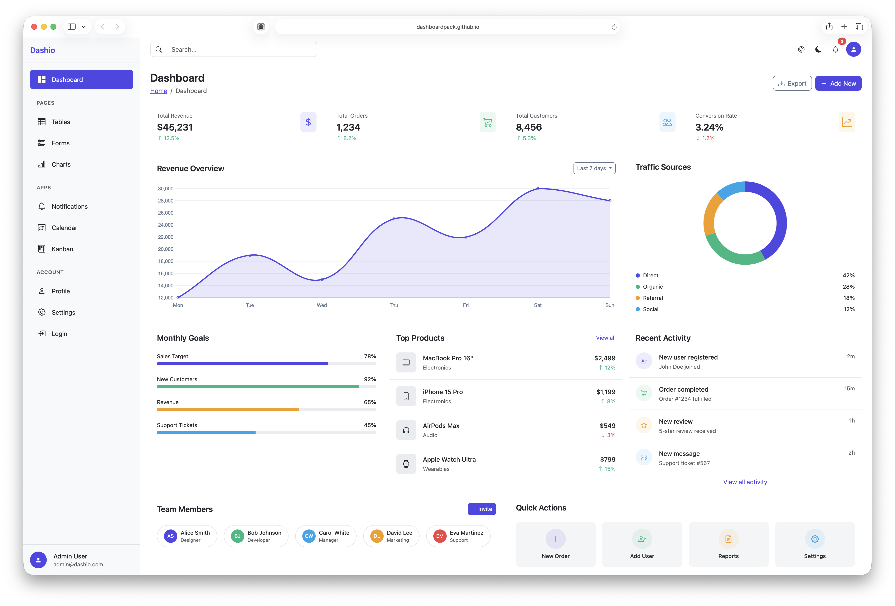

# Dashio - Bootstrap 5 Admin Dashboard Template

Dashio is a free, open-source admin dashboard template built with Bootstrap 5.3 and Vite 7. It provides a clean, modern foundation for building web applications, admin panels, SaaS products, and internal tools.

[](https://dashboardpack.github.io/dashio-template/)

**[Live Demo](https://dashboardpack.github.io/dashio-template/)**

## Why Dashio?

- **Modern Stack** - Built with Vite 7 for lightning-fast development and Bootstrap 5.3 for a solid CSS foundation
- **7 Dashboard Variants** - Pre-built dashboards for Analytics, E-commerce, CRM, Projects, SaaS, and Finance use cases
- **21 Ready-to-Use Pages** - Everything you need to get started: authentication, settings, tables, forms, charts, and more
- **Dark/Light Mode** - Native Bootstrap dark mode with system preference detection
- **Runtime Color Switcher** - Change the primary color on-the-fly without rebuilding
- **Responsive Design** - Mobile-first approach that works on all screen sizes
- **No jQuery** - Pure vanilla JavaScript with ES modules
- **Well Organized** - Clean code structure that's easy to understand and extend

## Quick Start

```bash
npm install
npm run dev
```

Opens at `http://localhost:3000`

## Build

```bash
npm run build    # Output to dist/
npm run preview  # Preview production build
```

## Tech Stack

- **Vite 7** - Build tool with hot module replacement
- **Bootstrap 5.3** - CSS framework with native dark mode
- **Bootstrap Icons 1.13** - 2,000+ icons
- **Chart.js 4** - Charts and graphs
- **Sass** - CSS preprocessor

## Pages Included

| Category | Pages |
|----------|-------|
| **Dashboards** | Main, Analytics, E-commerce, CRM, Projects, SaaS, Finance |
| **Core** | Tables, Forms, Charts |
| **Auth** | Login, Register, Forgot Password |
| **Account** | Profile, Settings |
| **Apps** | Notifications, Calendar, Kanban |
| **Utility** | Pricing, 404 Error, 500 Error |

## Project Structure

```
src/
├── index.html              # Main Dashboard
├── pages/                  # All other pages
│   ├── dashboard-*.html    # Dashboard variants
│   ├── tables.html         # Data tables
│   ├── forms.html          # Form elements
│   ├── charts.html         # Chart examples
│   └── ...                 # Other pages
├── js/
│   ├── main.js             # App initialization, theme, color switcher
│   └── charts.js           # Chart.js configuration
└── scss/
    ├── _variables.scss     # Bootstrap variable overrides
    └── styles.scss         # Main styles
```

## Features

### Dark/Light Mode

Toggle via the moon/sun icon in the header. Automatically detects system preference and saves choice to localStorage.

### Color Switcher (Demo Mode)

Click the palette icon to change the primary color. All primary-colored elements update instantly including buttons, links, form elements, charts, and sidebar.

**Disable for production:** In `vite.config.js`, set:

```js
define: {
  __DASHIO_DEMO__: false
}
```

This hides the color picker UI. Any previously saved color still applies.

### Charts

Six chart types are configured in `src/js/charts.js`:
- Line, Bar, Area (with axes)
- Doughnut, Pie, Polar Area

Charts automatically adapt to theme changes and color switcher selections.

## Customization

### Change Default Colors

Edit `src/scss/_variables.scss`:

```scss
$primary: #4f46e5;
$success: #10b981;
$danger: #ef4444;
```

### Add a New Page

1. Create HTML file in `src/pages/`
2. Add entry to `vite.config.js`:

```js
rollupOptions: {
  input: {
    // ...existing entries
    myPage: resolve(root, 'pages/my-page.html')
  }
}
```

3. Add navigation link to sidebar in your HTML

### Sidebar Navigation

The sidebar uses Bootstrap nav classes. Active page is marked with `.active`:

```html
<a class="nav-link active" href="/pages/tables.html">
  <i class="bi bi-table"></i>
  <span>Tables</span>
</a>
```

## Requirements

Node.js 20.19+ or 22.12+

## More Templates from DashboardPack

Looking for more options? Check out these templates from [DashboardPack](https://dashboardpack.com):

### Free Templates

- [ArchitectUI HTML Dashboard Free](https://dashboardpack.com/theme-details/architectui-html-dashboard-free) - Bootstrap 5 admin template
- [ArchitectUI React Dashboard Free](https://dashboardpack.com/theme-details/architectui-react-dashboard-free) - React 19 admin dashboard
- [ArchitectUI Vue Dashboard Free](https://dashboardpack.com/theme-details/architectui-dashboard-vue-free) - Vue.js admin template
- [ArchitectUI Angular Dashboard Free](https://dashboardpack.com/theme-details/architectui-angular-7-dashboard-free) - Angular 20 admin dashboard

### Premium Templates

- [ArchitectUI Dashboard HTML PRO](https://dashboardpack.com/theme-details/architectui-dashboard-html-pro) - Full-featured Bootstrap admin
- [TailPanel](https://dashboardpack.com/theme-details/tailpanel) - Tailwind CSS admin dashboard
- [Finance SaaS Dashboard](https://dashboardpack.com/theme-details/finance-saas-dashboard) - Financial application template
- [Analytic Dashboard](https://dashboardpack.com/theme-details/analytic-dashboard) - Data analytics template

Browse all templates at [dashboardpack.com](https://dashboardpack.com)

## License

This project is licensed under the [MIT License](LICENSE).

You are free to:

- Use commercially - Use in any commercial project
- Modify - Adapt, remix, and build upon the template
- Distribute - Share copies with others
- Use privately - Use for personal projects

The only requirement is to include the original copyright notice in any copy of the software.
